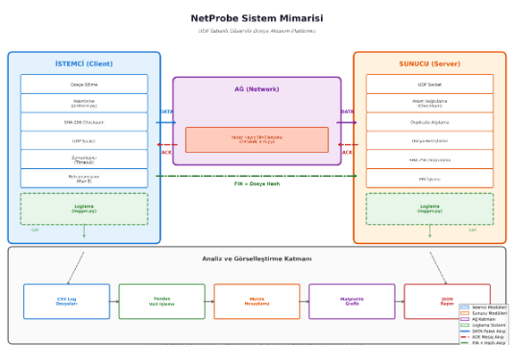
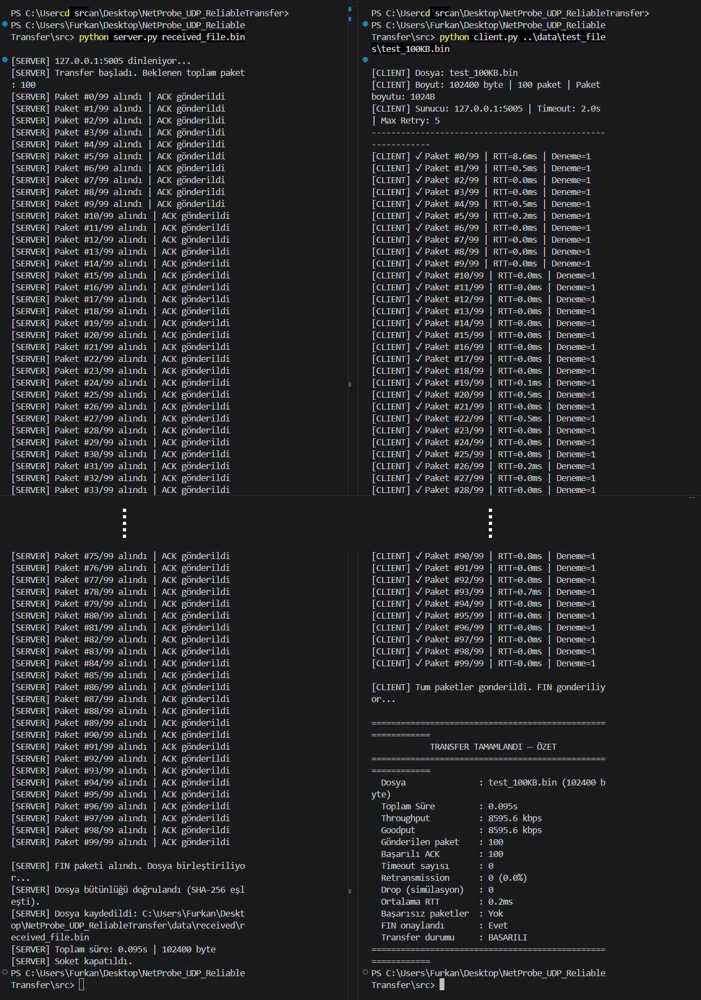
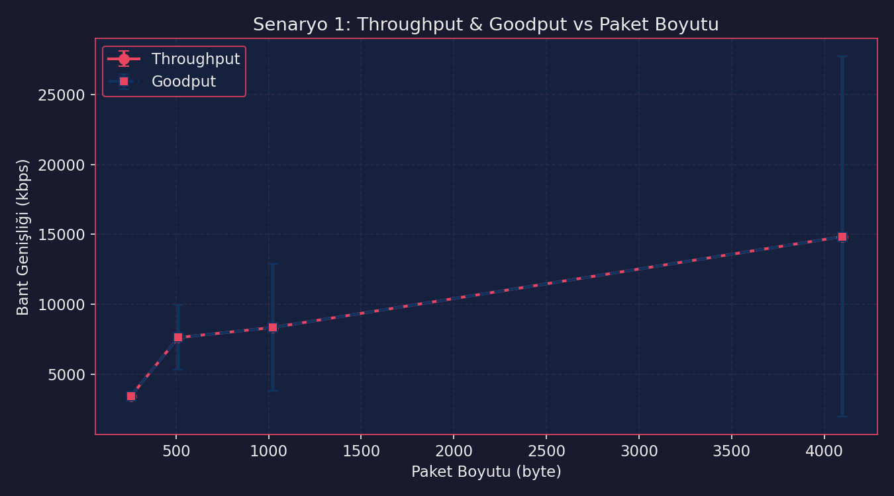
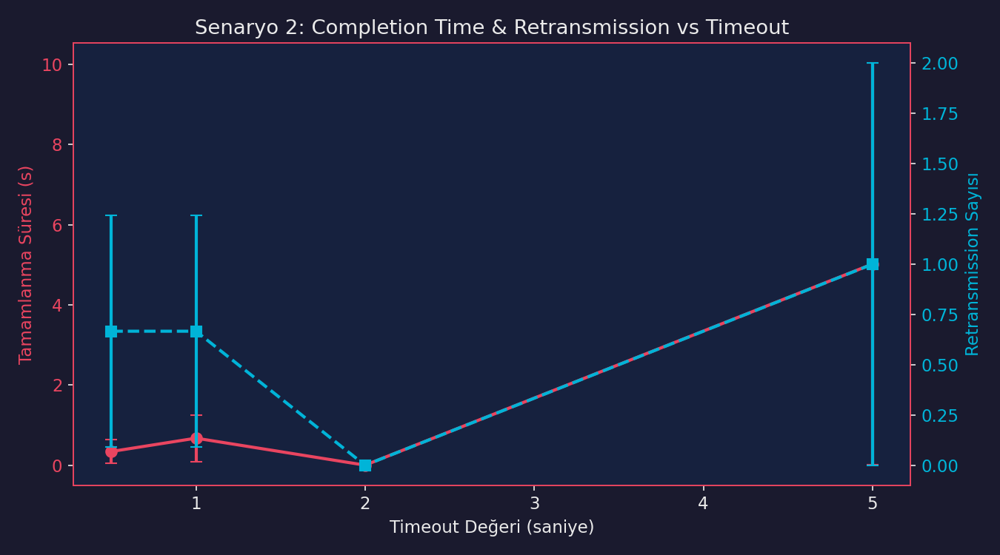
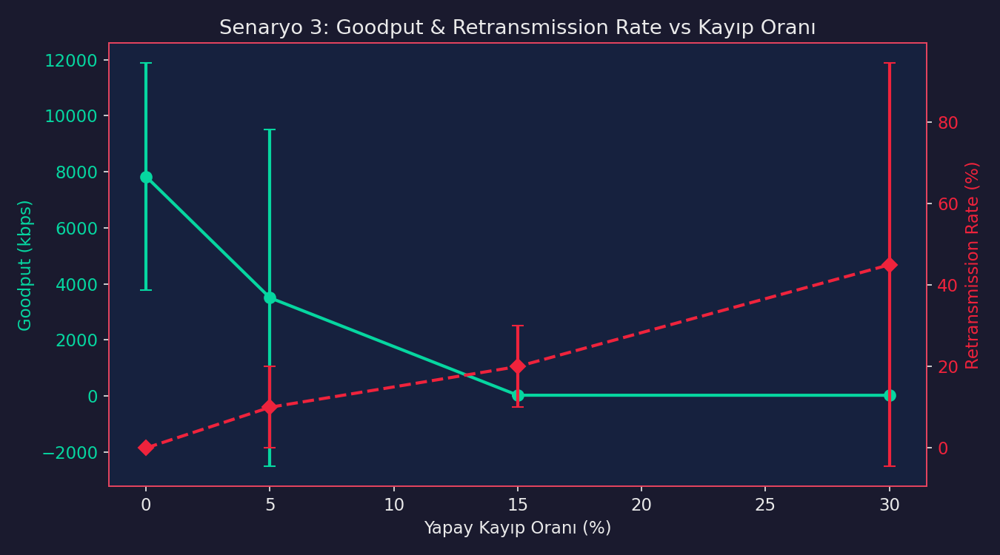
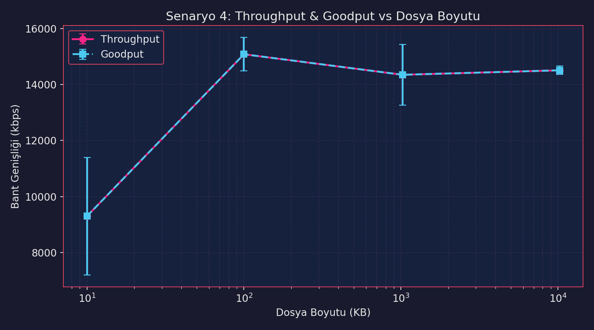
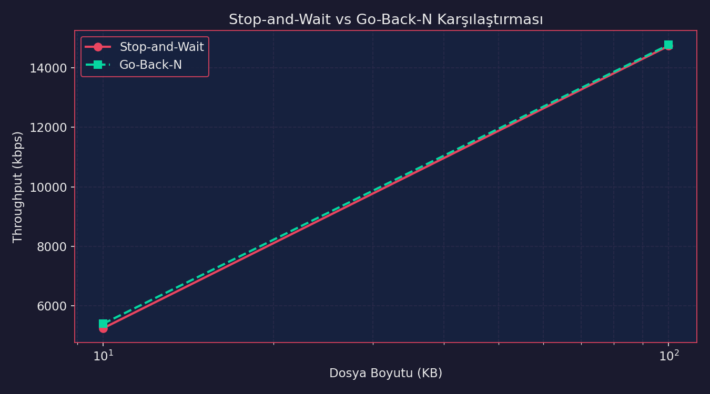
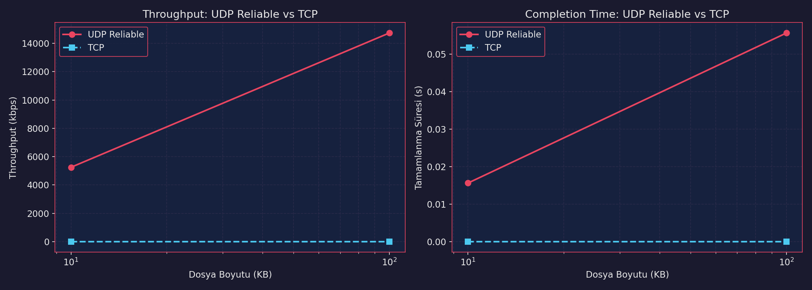
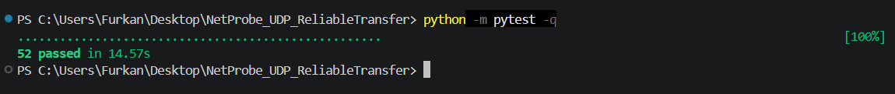

<h1 align="center">NetProbe UDP Reliable Transfer</h1>

<p align="center">
UDP üzerinde uygulama katmanında güvenilir dosya aktarımı, trafik izleme ve ağ performans analizi platformu.
</p>

<p align="center">
  
  
  
  
  
  
  
</p>

---

## Proje Özeti

NetProbe, Bursa Teknik Üniversitesi Bilgisayar Ağları dersi dönem projesi için geliştirilmiş bir UDP tabanlı güvenilir dosya aktarım sistemidir.

UDP, doğası gereği paket teslim garantisi, sıralama, ACK, timeout veya yeniden gönderim mekanizması sunmaz. Bu projede bu güvenilirlik mekanizmaları uygulama katmanında tasarlanmış ve Python socket programlama ile gerçekleştirilmiştir.

Sistem şunları yapar:

- UDP client/server üzerinden dosya aktarımı
- Stop-and-Wait güvenilir aktarım
- Sequence number, ACK, timeout ve retransmission yönetimi
- Paket bazlı SHA-256 checksum doğrulaması
- Transfer sonunda FIN paketi ve tüm dosya SHA-256 bütünlük kontrolü
- Duplicate paket algılama
- Client/server tarafında ayrı CSV trafik logları
- Throughput, goodput, RTT, loss rate, retry rate ve completion time ölçümü
- 4 zorunlu deney senaryosu için otomatik grafik üretimi
- Bonus olarak Go-Back-N, TCP karşılaştırması ve terminal dashboard

---

## Mimari



Genel veri akışı:

```text
Dosya -> Client -> UDP DATA paketleri -> Server -> Dosya yeniden oluşturma
              ^                         |
              |                         v
              -------- ACK paketleri ----

Transfer olayları -> CSV logları -> Analiz modülü -> Grafikler ve metrikler
```

Temel modüller:

| Modül | Görev |
| --- | --- |
| `protocol.py` | DATA, ACK ve FIN paketlerinin oluşturulması ve ayrıştırılması |
| `client.py` | Stop-and-Wait UDP istemci aktarımı |
| `server.py` | UDP sunucu, ACK üretimi ve dosya birleştirme |
| `logger.py` | Client/server trafik olaylarının CSV olarak kaydedilmesi |
| `analysis.py` | Loglardan metrik hesaplama ve grafik üretimi |
| `network_sim.py` | Test dosyası üretimi, kayıp/gecikme simülasyonu ve deney yardımcıları |
| `run_experiments.py` | Zorunlu deney senaryoları ve bonus karşılaştırmaların otomasyonu |

---

## Demo

### Terminal Üzerinden Başarılı Aktarım



Terminal 1:

```bash
cd src
python server.py received_file.bin
```

Terminal 2:

```bash
cd src
python client.py ..\data\test_files\test_100KB.bin
```

Başarılı aktarımda istemci tarafında `Transfer durumu: BASARILI`, sunucu tarafında ise SHA-256 bütünlük doğrulaması görülür.

---

## Güvenilir Aktarım Tasarımı

### Paket Yapısı

Projede üç temel paket tipi kullanılır:

| Paket | Alanlar | Amaç |
| --- | --- | --- |
| DATA | packet type, sequence number, total packets, payload length, checksum, payload | Dosya parçası taşır |
| ACK | packet type, ack number, reserved | Alınan paketi onaylar |
| FIN | packet type, file checksum | Transferin bittiğini ve tüm dosya hash bilgisini taşır |

### Stop-and-Wait Mantığı

Client her paketi sırayla gönderir ve ilgili ACK paketini bekler. ACK gelirse sonraki pakete geçilir. Timeout oluşursa aynı paket tekrar gönderilir. Her veri paketi için maksimum yeniden gönderim sayısı `MAX_RETRIES = 5` olarak belirlenmiştir.

Server tarafında duplicate paket gelirse aynı veri dosyaya ikinci kez yazılmaz; yalnızca uygun ACK tekrar gönderilir.

---

## Performans Deneyleri

Deneyler `src/run_experiments.py` ile otomatik çalıştırılır. Her ana veri noktası `N_REPEATS = 3` tekrar ile ölçülür.

| Senaryo | Değişen Parametre | Ölçülen Etki |
| --- | --- | --- |
| Senaryo 1 | Paket boyutu: 256, 512, 1024, 4096 byte | Throughput ve goodput |
| Senaryo 2 | Timeout: 0.5, 1.0, 2.0, 5.0 saniye | Completion time ve retransmission |
| Senaryo 3 | Kayıp oranı: 0%, 5%, 15%, 30% | Goodput ve retransmission rate |
| Senaryo 4 | Dosya boyutu: 10KB, 100KB, 1MB, 10MB | Ölçeklenebilirlik ve aktarım verimi |

### Paket Boyutu Etkisi



### Timeout Etkisi



### Kayıp Oranı Etkisi



### Dosya Boyutu Etkisi



---

## Bonus Özellikler

### Stop-and-Wait vs Go-Back-N

Stop-and-Wait yaklaşımına ek olarak Go-Back-N sliding window mekanizması da geliştirilmiştir. Bu sayede birden fazla paketin aynı anda uçuşta olduğu pencere tabanlı aktarım davranışı incelenebilir.



### UDP Reliable vs TCP Karşılaştırması

Aynı dosya boyutları için uygulama katmanında güvenilir hale getirilen UDP aktarımı ile TCP aktarımı karşılaştırılmıştır.



Ek bonuslar:

- Go-Back-N istemci/sunucu aktarımı
- TCP karşılaştırma deneyi
- Terminal dashboard
- Otomatik deney yürütme sistemi
- Başarısız runları grafik metriklerini bozmayacak şekilde dışarıda bırakma

---

## Test ve Doğrulama



Testleri çalıştırmak için:

```bash
python -m compileall -q src tests
python -m pytest -q
```

Test kapsamı:

- Paket oluşturma ve ayrıştırma
- SHA-256 checksum doğrulaması
- ACK ve FIN paketleri
- Logger çıktıları
- Stop-and-Wait dosya bütünlüğü
- Kayıp simülasyonu altında aktarım
- Duplicate paket davranışı
- Go-Back-N temel aktarımı

---

## Kurulum ve Çalıştırma

### 1. Repoyu Klonla

```bash
git clone https://github.com/AFurkanOcel/NetProbe_UDP_ReliableTransfer.git
cd NetProbe_UDP_ReliableTransfer
```

### 2. Bağımlılıkları Kur

Python 3.10+ önerilir.

```bash
pip install -r requirements.txt
```

### 3. Test Dosyalarını Üret

```bash
cd src
python network_sim.py
```

Bu komut `data/test_files/` altında şu dosyaları hazırlar:

- `test_10KB.bin`
- `test_100KB.bin`
- `test_1MB.bin`
- `test_10MB.bin`

### 4. Stop-and-Wait Demo

Terminal 1:

```bash
cd src
python server.py received_file.bin
```

Terminal 2:

```bash
cd src
python client.py ..\data\test_files\test_100KB.bin
```

### 5. Go-Back-N Demo

Terminal 1:

```bash
cd src
python server_gbn.py received_gbn.bin
```

Terminal 2:

```bash
cd src
python client_gbn.py ..\data\test_files\test_100KB.bin
```

### 6. TCP Karşılaştırması

```bash
cd src
python tcp_transfer.py ..\data\test_files\test_100KB.bin
```

### 7. Tüm Deneyleri Çalıştır

```bash
cd src
python run_experiments.py
```

Ayrıntılı deney çıktıları `data/logs/experiment_console.log` dosyasına, grafikler ise `results/graphs/` klasörüne yazılır.

---

## Proje Yapısı

```text
NetProbe_UDP_ReliableTransfer/
|
|-- assets/
|   `-- screenshots/          README görselleri
|-- data/
|   |-- logs/                 Çalışma sırasında oluşan loglar
|   |-- received/             Alınan dosyalar
|   `-- test_files/           Üretilen test dosyaları
|-- results/
|   `-- graphs/               Deney grafikleri ve metrics JSON
|-- src/
|   |-- config.py             Parametreler
|   |-- protocol.py           DATA / ACK / FIN paketleri
|   |-- client.py             Stop-and-Wait UDP istemci
|   |-- server.py             Stop-and-Wait UDP sunucu
|   |-- client_gbn.py         Go-Back-N istemci
|   |-- server_gbn.py         Go-Back-N sunucu
|   |-- tcp_transfer.py       TCP karşılaştırması
|   |-- logger.py             CSV olay kaydı
|   |-- analysis.py           Metrik ve grafik üretimi
|   |-- network_sim.py        Kayıp/gecikme ve test dosyası yardımcıları
|   `-- run_experiments.py    Deney otomasyonu
|-- tests/                    Unit ve entegrasyon testleri
|-- report/                   Proje raporu için ayrılan klasör
|-- README.md
|-- requirements.txt
`-- pytest.ini
```

---

## Üretilen Çıktılar

| Çıktı | Konum |
| --- | --- |
| Client logları | `data/logs/transfer_log_client.csv` |
| Server logları | `data/logs/transfer_log_server.csv` |
| Deney konsol logu | `data/logs/experiment_console.log` |
| Alınan dosyalar | `data/received/` |
| Test dosyaları | `data/test_files/` |
| Deney grafikleri | `results/graphs/` |
| Toplu metrik JSON | `results/graphs/all_experiment_metrics.json` |

Not: Loglar, alınan dosyalar ve test binary dosyaları çalışma sırasında üretildiği için `.gitignore` ile GitHub dışında tutulur.

---

## Proje Raporu

Proje raporu bu bölüme daha sonra eklenecektir.

---

## Grup Görev Dağılımı

| Üye | GitHub | Sorumluluk Alanı |
| --- | --- | --- |
| Mustafa Can ERSOY | [MustafaCanErsoy](https://github.com/MustafaCanErsoy) | Proje amacı, UDP protokol tasarımı, Stop-and-Wait client/server, checksum ve güvenilir aktarım |
| A. Furkan ÖCEL | [AFurkanOcel](https://github.com/AFurkanOcel) | Trafik izleme, loglama, ağ simülasyonu, metrik hesaplama, grafik üretimi ve deney analizi |
| Murat DEMİRBAŞ | [demirbas1436](https://github.com/demirbas1436) | Go-Back-N, TCP karşılaştırması, terminal dashboard, deney otomasyonu ve test doğrulama |

---

## Tasarım Notları

Bu proje akademik bir bilgisayar ağları çalışması olarak tasarlanmıştır. Bu nedenle hazır bir dosya aktarım kütüphanesi kullanmak yerine güvenilir aktarım mekanizması uygulama katmanında geliştirilmiştir.

Öne çıkan tasarım kararları:

- UDP socket programlama doğrudan kullanıldı.
- Paket formatı proje içinde açıkça tanımlandı.
- Her paket için SHA-256 checksum kontrolü yapıldı.
- Transfer sonunda tüm dosya hash değeri doğrulandı.
- Başarısız paketlerde transfer durumu açıkça kullanıcıya ve loglara yansıtıldı.
- Deney sonuçları sadece grafik olarak değil, JSON metrik dosyası olarak da saklandı.

---

## Gelecek Geliştirmeler

- Selective Repeat protokolünün eklenmesi
- Çoklu istemci desteği
- Wireshark veya pcap tabanlı paket analizi
- Web tabanlı gerçek zamanlı dashboard
- Farklı ağ ortamlarında laboratuvar testleri
- Basit şifreleme veya sıkıştırma desteği

---

## Lisans

Bu proje eğitim amacıyla geliştirilmiştir.
